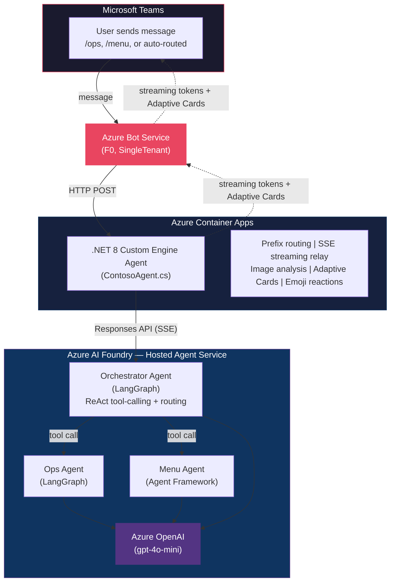

# Contoso Multi-Agent Teams Hub

> **Disclaimer:** Provided diagrams, documents, and code are provided AS IS without warranty of any kind and should not be interpreted as an offer or commitment on the part of Microsoft, and Microsoft cannot guarantee the accuracy of any information presented. MICROSOFT MAKES NO WARRANTIES, EXPRESS OR IMPLIED, IN THIS DIAGRAM(s) DOCUMENT(s) CODE SAMPLE(s).

Deploy multiple AI agents to Microsoft Teams using Azure AI Foundry Hosted Agents, the M365 Agents SDK, and Bicep IaC. One `azd provision && azd deploy` gives you a working multi-agent bot in Teams.

## Why This Template

Agents that work in a notebook need a frontend, auth wiring, and infrastructure before employees can use them. This template puts agents into Microsoft Teams directly. The [M365 Agents SDK](https://github.com/microsoft/agents) handles streaming, Adaptive Cards, file uploads, and reactions. One bot registration serves every agent.

Agent code runs on [Azure AI Foundry Hosted Agents](https://learn.microsoft.com/azure/ai-foundry/agents/overview). You write a Python container in any framework (LangGraph, Agent Framework, Semantic Kernel, AutoGen) and Foundry manages runtime, scaling, tracing, content safety, and identity. This template uses LangGraph for the orchestrator and ops agent, and Microsoft Agent Framework for the menu agent, to show that Hosted Agents are framework-agnostic.

The only compute you deploy is a single lightweight bot proxy on Container Apps. Adding a new agent is another `azd deploy`, not a new infrastructure project.

---

## Architecture



## What's Included

| Feature | Description |
|---------|-------------|
| **Multi-agent orchestration** | ReAct orchestrator uses LLM tool-calling to classify intent and route to sub-agents |
| **Streaming responses** | SSE relay pipes Foundry agent tokens to Teams in real-time via the M365 Agents SDK |
| **Adaptive Cards** | Auto-generated KPI dashboards (Ops) and creative brief cards (Menu) from agent response text |
| **Image analysis** | Multi-layer image download pipeline with GPT vision analysis for uploaded photos |
| **Reaction handling** | Contextual follow-up messages when users react to bot responses |
| **Multi-framework agents** | LangGraph (orchestrator + ops) and Agent Framework (menu) deployed as Foundry Hosted Agents via framework-specific adapters |
| **Brand detection** | Automatic brand identification across Contoso Burger, Contoso Tacos, and Contoso Pizza |
| **Infrastructure-as-Code** | Bicep modules with `azd` lifecycle hooks for single-command provision and deploy |
| **Prefix commands** | `/ops` and `/menu` bypass the orchestrator for direct agent access |
| **Teams app manifest** | Templatized manifest with `${{BOT_ID}}` substitution for sideloading |

## Prerequisites

| Tool | Version | Purpose |
|------|---------|---------|
| [Azure Subscription](https://azure.microsoft.com/free/) | -- | Cloud resources |
| [.NET 8 SDK](https://dotnet.microsoft.com/download/dotnet/8.0) | 8.0+ | Bot build |
| [Python](https://www.python.org/downloads/) | 3.11+ | Hosted agent code + deploy script |
| [Docker Desktop](https://www.docker.com/products/docker-desktop/) | Latest | Container builds (local dev only; `azd deploy` uses ACR build tasks) |
| [Azure CLI](https://learn.microsoft.com/cli/azure/install-azure-cli) | 2.60+ | Azure resource management |
| [Azure Developer CLI (azd)](https://learn.microsoft.com/azure/developer/azure-developer-cli/install-azd) | 1.9+ | Provision and deploy |
| [PowerShell 7 (pwsh)](https://learn.microsoft.com/powershell/scripting/install/installing-powershell) | 7.0+ | Required for lifecycle scripts. Windows PowerShell 5.1 works but has encoding quirks with `az acr build` log streaming. |
| Microsoft 365 tenant | -- | Teams access for testing |

## Quick Start

### 1. Clone and Configure

```bash
git clone https://github.com/nicksangeorge/foundry-teams-hosted-agenthub.git
cd foundry-teams-hosted-agenthub

cp sample.env .env
# Edit .env with your AZURE_SUBSCRIPTION_ID, AZURE_LOCATION, etc.
```

### 2. Create Bot Identity

Create an Entra ID app registration for the bot:

```powershell
./scripts/setup-bot-identity.ps1
```

This creates the app registration and outputs `BOT_APP_ID`, `BOT_APP_SECRET`, and `TENANT_ID`. Add them to your `.env` file or let the script set them in the azd environment.

### 3. Initialize azd Environment

```bash
azd auth login
azd env new <your-env-name>
```

Then set required values from your `.env`:

```bash
azd env set BOT_APP_ID <value>
azd env set BOT_APP_SECRET <value>
azd env set TENANT_ID <value>
azd env set AZURE_LOCATION <value>
```

> **Note:** `azd env new` must run before `azd provision`. Without an environment, `azd env get-value` calls in lifecycle scripts will fail.

### 4. Provision Infrastructure

```bash
azd provision
```

This deploys:
- Azure AI Foundry account (AIServices) with a project and gpt-4o-mini deployment
- Account-level capability host for hosted agent container management
- Azure Container Registry
- Azure Container Apps environment and app
- Azure Bot Service with Teams channel
- RBAC role assignments (OpenAI User, AI Developer, AcrPull)
- Log Analytics workspace

The `postprovision` hook creates the capability host via REST API (the Bicep schema does not support `enablePublicHostingEnvironment`) and grants RBAC to the auto-generated agent identity.

> If you change Bicep templates after a previous deployment, use `azd provision --no-state` to force a fresh ARM deployment.

### 5. Deploy

```bash
azd deploy
```

This:
- Builds ops-agent, menu-agent, and orchestrator-agent Docker images via ACR build tasks
- Deploys the .NET bot to Container Apps
- Creates hosted agent versions in Foundry with `min_replicas=1` (auto-start)

### 6. Install in Teams

Package the Teams app manifest:

```powershell
./scripts/package-app.ps1 -BotAppId "<your-bot-app-id>"
```

If `BOT_APP_ID` is set in the azd environment, you can omit the parameter:

```powershell
./scripts/package-app.ps1
```

Then sideload the generated `appPackage.zip`:

1. Open Microsoft Teams
2. Go to **Apps** > **Manage your apps** > **Upload a custom app**
3. Select `appPackage.zip` and install

Type `/help` in the bot chat to see available commands.

## Project Structure

```
contoso-multiagent-teams/
│
├── README.md                          # This file
├── azure.yaml                         # azd project configuration
├── sample.env                         # Environment variable template
│
├── appPackage/
│   └── manifest.json                  # Teams app manifest (templatized)
│
├── bot/                               # .NET 8 Custom Engine Agent
│   ├── ContosoAgent.cs                # Main bot: routing, streaming, reactions
│   ├── Program.cs                     # ASP.NET host, dependency injection
│   ├── ContosoAgentBot.csproj         # Project file (M365 Agents SDK v1.4.x)
│   ├── Dockerfile                     # Multi-stage container build
│   ├── appsettings.template.json      # Configuration template
│   └── Services/
│       ├── FoundryAgentService.cs     # SSE streaming client for Responses API
│       ├── IFoundryAgentService.cs    # Interface + AgentResponse DTO
│       ├── AdaptiveCardService.cs     # Adaptive Card builder (KPI + creative)
│       └── ImageAnalysisService.cs    # GPT vision image analysis
│
├── agents/                            # Python Hosted Agents
│   ├── deploy_hosted_agents.py        # SDK deployment script (creates versions + sets min_replicas)
│   ├── requirements.txt               # Deploy script dependencies
│   ├── orchestrator/
│   │   ├── main.py                    # LangGraph ReAct orchestrator with sub-agent tool calls
│   │   ├── agent.yaml                 # azd agent definition
│   │   ├── Dockerfile                 # Python 3.12 container
│   │   └── requirements.txt           # Python dependencies
│   ├── ops-agent/
│   │   ├── main.py                    # LangGraph ops agent
│   │   ├── agent.yaml                 # azd agent definition
│   │   ├── Dockerfile                 # Python 3.12 container
│   │   └── requirements.txt           # Python dependencies
│   └── menu-agent/
│       ├── main.py                    # Agent Framework menu and marketing agent
│       ├── agent.yaml                 # azd agent definition
│       ├── Dockerfile                 # Python 3.12 container
│       └── requirements.txt           # Python dependencies
│
├── infra/                             # Bicep IaC modules
│   ├── main.bicep                     # Orchestrates all modules
│   ├── main.parameters.json           # Parameter bindings
│   ├── abbreviations.json             # Naming conventions
│   └── modules/
│       ├── ai.bicep                   # AI Foundry account + project + model deployment
│       ├── acr.bicep                  # Container Registry
│       ├── container-app.bicep        # Container Apps + environment + Log Analytics
│       ├── rbac.bicep                 # Role assignments (OpenAI User, AI Developer, AcrPull)
│       └── bot-service.bicep          # Bot Service + Teams channel
│
├── scripts/                           # Automation scripts
│   ├── setup-bot-identity.ps1         # Create Entra ID app registration
│   ├── package-app.ps1                # Package appPackage for Teams sideloading
│   ├── postprovision.ps1              # Create capability host + grant agent identity RBAC
│   └── postdeploy.ps1                 # Build agent images via ACR + deploy to Foundry
│
└── docs/                              # Documentation
    ├── ARCHITECTURE.md                # System architecture and data flows
    ├── CUSTOMIZATION.md               # How to customize and extend the template
    ├── HOSTED-AGENTS-GUIDE.md         # Azure AI Foundry Hosted Agents guide
    ├── HOSTED-AGENTS-API-REFERENCE.md # Hosted Agents API reference
    └── TEAMS-CAPABILITIES.md          # Teams bot features and capabilities
```

## Technology Stack

| Layer | Technology | Notes |
|-------|-----------|-------|
| Bot Runtime | ASP.NET Core + M365 Agents SDK | .NET 8 / SDK 1.4.x-beta |
| Agent Frameworks | LangGraph (orchestrator + ops), Microsoft Agent Framework (menu) | LangGraph 0.2+ / AF 1.0.0b+ |
| Hosting Adapters | `azure-ai-agentserver-langgraph`, `azure-ai-agentserver-agentframework` | 1.0.0b10+ / 1.0.0b12+ |
| AI Models | Azure OpenAI (gpt-4o-mini) | 2025-03-01-preview |
| Bot Hosting | Azure Container Apps | Single replica by default |
| Agent Hosting | Azure AI Foundry Hosted Agent Service | Managed containers with auto-scaling |
| Bot Registration | Azure Bot Service (F0, SingleTenant) | -- |
| Container Registry | Azure Container Registry (Basic) | ACR build tasks for cloud-side image builds |
| Auth | DefaultAzureCredential / MSAL | Azure.Identity 1.17+ |
| IaC | Bicep + Azure Developer CLI (azd) | `2025-04-01-preview` for AI resources |
| Adaptive Cards | Adaptive Cards SDK | 3.1.0 |
| Teams Manifest | Teams App Manifest v1.17 | -- |

## Known Limitations

- **Agent Framework timeout**: The menu agent uses Microsoft Agent Framework, which creates a temporary data-plane agent and thread on each request via `AzureAIAgentClient`. This adds ~40s latency per request and can exceed the 100s proxy timeout. The LangGraph agents (ops, orchestrator) call the LLM directly and respond in ~2-5s.
- **Orchestrator cascading timeout**: If the orchestrator routes to the menu agent, the sub-agent call may itself time out, causing the orchestrator to exceed 100s total.
- **Capability host API version**: The `enablePublicHostingEnvironment` property required for hosted agents is only available in the `2025-10-01-preview` REST API, not in the `2025-04-01-preview` Bicep schema. The `postprovision` hook creates it via REST.
- **Agent identity RBAC**: Foundry auto-creates a service principal (`<account>-<project>-AgentIdentity`) for hosted agent containers. This identity needs `Cognitive Services OpenAI User` and `Azure AI Developer` roles, but it is created asynchronously after capability host provisioning. The `postprovision` hook assigns these roles, but on first deployment they may not be available yet.
- **Do not reuse account names after deletion**: Deleting and recreating an Azure AI Foundry account with the same name can leave stale internal state (the `@AML` synthetic workspace). Use a new azd environment name to generate fresh resource names.

## Customization

See [docs/CUSTOMIZATION.md](docs/CUSTOMIZATION.md) for details on:

- Changing brands and demo data
- Adding a new hosted agent
- Modifying Adaptive Cards
- Adjusting image analysis prompts
- Environment-specific configuration

## Documentation

| Document | Description |
|----------|-------------|
| [ARCHITECTURE.md](docs/ARCHITECTURE.md) | System architecture, data flows, auth model |
| [CUSTOMIZATION.md](docs/CUSTOMIZATION.md) | Customization and extension guide |
| [HOSTED-AGENTS-GUIDE.md](docs/HOSTED-AGENTS-GUIDE.md) | Azure AI Foundry Hosted Agents deep-dive |
| [HOSTED-AGENTS-API-REFERENCE.md](docs/HOSTED-AGENTS-API-REFERENCE.md) | Hosted Agents API reference |
| [TEAMS-CAPABILITIES.md](docs/TEAMS-CAPABILITIES.md) | Teams bot features |

## Contributing

1. Fork the repository
2. Create a feature branch (`git checkout -b feature/my-feature`)
3. Commit your changes (`git commit -am 'Add support for ...'`)
4. Push to the branch (`git push origin feature/my-feature`)
5. Open a Pull Request

New agents should include `agent.yaml`, `Dockerfile`, `requirements.txt`, and `main.py`. Bicep modules should follow the naming conventions in `infra/abbreviations.json`.

---

Built with [M365 Agents SDK](https://github.com/microsoft/agents) and [Azure AI Foundry](https://ai.azure.com).
